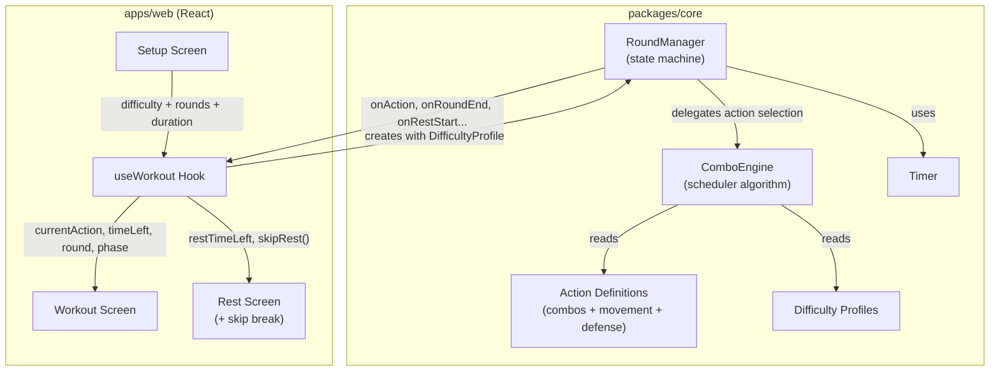

# Boxing Coach Web App

## Boxing Number System

Standard boxing numbering used throughout:

| #   | Punch | #   | Punch |
| --- | ----- | --- | ----- |

- **1** = Jab
- **2** = Cross
- **3** = Lead Hook
- **4** = Rear Hook
- **5** = Lead Uppercut
- **6** = Rear Uppercut

At higher levels, add modifiers: **B** (body), **Slip**, **Roll** for defense.

### Non-Punch Actions (interleaved between combos)

**Movement commands:** "MOVE MOVE", "TOUCH AND MOVE", "CIRCLE LEFT", "CIRCLE RIGHT", "STEP BACK"

**Defense commands:** "HANDS UP", "SLIP", "ROLL", "BLOCK", "PARRY"

These are NOT punch combos -- they are separate action types the coach calls out between combinations to simulate realistic training.

---

## Monorepo Structure (Turborepo + pnpm)

```
boxing-coach/
├── turbo.json
├── package.json
├── packages/
│   └── core/                    # Shared logic (platform-agnostic)
│       ├── src/
│       │   ├── combos/          # Combo definitions + difficulty tags
│       │   │   ├── beginner.ts
│       │   │   ├── intermediate.ts
│       │   │   └── advanced.ts
│       │   ├── engine/          # Combo selection + progression logic
│       │   │   ├── combo-engine.ts
│       │   │   └── round-manager.ts
│       │   ├── timer/           # Round timer (pure logic, no UI)
│       │   │   └── timer.ts
│       │   └── types.ts         # Shared types
│       └── package.json
├── apps/
│   ├── web/                     # React + Vite PWA
│   │   ├── src/
│   │   │   ├── components/
│   │   │   ├── screens/
│   │   │   ├── hooks/
│   │   │   └── App.tsx
│   │   └── package.json
│   └── mobile/                  # (future) React Native
└── .gitignore
```

---

## `packages/core` - The Brain

This is the key architectural decision: **all boxing logic lives here**, completely decoupled from any UI framework. Both web and future mobile apps import from this package.

### Action Types

The engine doesn't just output combos -- it outputs **actions** of three types:

```typescript
type ActionType = "combo" | "movement" | "defense";

interface Action {
  id: string;
  type: ActionType;
  label: string; // "1-2-3" or "MOVE MOVE" or "SLIP"
  description: string; // "Jab - Cross - Hook" or "Lateral movement"
  difficulty: Difficulty;
}
```

### Combo Definitions (per difficulty ceiling)

**Beginner** (punches 1-2 only, short sequences):

- 1, 2, 1-1, 1-2, 1-1-2, 1-2-1-2, double jab

**Intermediate** (adds hooks 3-4, longer sequences):

- 1-2-3, 1-2-3-2, 1-2-1-2-3, 3-2, 2-3-2, 3-2-3

**Advanced** (all 6 punches, body shots, combo-defense hybrids):

- 1-2-3-4-2, 1-2-5-2, slip-1-2, roll-3-2, 1-2-B3-B2, 5-6-2

### Movement Commands

- MOVE MOVE (basic lateral movement)
- TOUCH AND MOVE (light jab then reposition)
- CIRCLE LEFT / CIRCLE RIGHT
- STEP BACK
- IN AND OUT (advanced)

### Defense Commands

- HANDS UP (beginner)
- SLIP (intermediate)
- ROLL (intermediate)
- BLOCK (beginner)
- PARRY (advanced)
- SLIP-SLIP (advanced)

---

## How the Engine Works (detailed)

### Core Concept: Difficulty = Ceiling + Escalation Rate

The selected difficulty determines two things: (1) **how hard it eventually gets** (the ceiling), and (2) **how fast it ramps up** (escalation rate). Every level starts manageable and builds gradually.

- **Beginner**: starts with the simplest combos (1, 1-2). Ramps up **slowly**. Even by the final round, you only see the beginner pool. Pace barely tightens. Movement/defense stays infrequent and basic (MOVE MOVE, HANDS UP, BLOCK).
- **Intermediate**: starts with beginner combos too. Ramps up at a **moderate** pace. By the middle rounds you're seeing intermediate combos (hooks, longer sequences). By the final rounds you're getting the full intermediate pool at a solid pace with regular SLIP, ROLL commands.
- **Advanced**: also starts with beginner combos for the first round or two as a warm-up. Ramps up **quickly**. By round 2-3 intermediate combos appear. By the midpoint the full advanced pool is unlocked (uppercuts, body shots, combo-defense hybrids). Pace gets aggressive. Movement and defense commands become frequent.

### Difficulty Profiles

Each difficulty level has a **DifficultyProfile** that controls every parameter:

```typescript
interface DifficultyProfile {
  comboPools: {
    // which combos are available, grouped by when they unlock
    initial: Action[]; // available from round 1
    mid: Action[]; // unlock after ~33% of total rounds
    late: Action[]; // unlock after ~66% of total rounds
  };
  movementPool: Action[]; // available movement commands
  defensePool: Action[]; // available defense commands
  interval: {
    base: number; // ms between actions at round 1
    min: number; // fastest it can ever get (floor)
    tightenPerRound: number; // ms subtracted per round
  };
  actionMix: {
    movementEveryN: number; // insert movement every N actions
    defenseEveryN: number; // insert defense every N actions
  };
}
```

**Beginner profile (slow build, low ceiling):**

- `interval: { base: 6000, min: 4500, tightenPerRound: 150 }` -- starts slow, barely speeds up
- `movementEveryN: 5`, `defenseEveryN: 8` -- infrequent
- Pools: beginner set A in `initial`, beginner set B in `mid`, beginner set C in `late` (all beginner-level, just more variety over time)
- Movement/defense pools: only basic commands (MOVE MOVE, HANDS UP, BLOCK)

**Intermediate profile (moderate build, medium ceiling):**

- `interval: { base: 5500, min: 3000, tightenPerRound: 250 }` -- starts comfortable, builds steadily
- `movementEveryN: 4`, `defenseEveryN: 5`
- Pools: beginner combos in `initial`, intermediate combos in `mid`, harder intermediate in `late`
- Movement/defense pools: adds SLIP, ROLL, CIRCLE LEFT/RIGHT in mid rounds

**Advanced profile (gradual build but reaches high ceiling fast):**

- `interval: { base: 5000, min: 2000, tightenPerRound: 400 }` -- starts at a warm-up pace but tightens aggressively each round
- `movementEveryN: 3`, `defenseEveryN: 4` -- starts moderate, but `movementEveryN` and `defenseEveryN` also tighten by 1 at the midpoint (becomes every 2 / every 3)
- Pools: beginner combos in `initial` (warm-up), intermediate + some advanced in `mid`, full advanced pool in `late`
- Movement/defense pools: basic in round 1, full pool (PARRY, SLIP-SLIP, IN AND OUT) unlocks at midpoint

### The Scheduler Algorithm (step by step)

Every time the engine needs to produce the next action, it runs this:

```
1. INCREMENT action counter

2. DECIDE action type:
   - If counter % defenseEveryN == 0  → type = 'defense'
   - Else if counter % movementEveryN == 0  → type = 'movement'
   - Else → type = 'combo'

3. BUILD available pool for the chosen type:
   - For 'combo':
     - Start with comboPools.initial
     - If currentRound > totalRounds * 0.33 → add comboPools.mid
     - If currentRound > totalRounds * 0.66 → add comboPools.late
   - For 'movement' / 'defense':
     - Use movementPool or defensePool directly

4. FILTER out recent history:
   - Keep a sliding window of last 4 actions
   - Remove any action from pool that matches last 4

5. PICK randomly from remaining pool

6. CALCULATE next interval:
   - interval = base - (currentRound * tightenPerRound)
   - Clamp to min
   - Add random jitter of +/- 500ms (feels more human)

7. EMIT the action + wait for the interval
```

### Visual Example: 3-Round Beginner Workout

```
ROUND 1 (interval ~6s):
  "1-2"        → Jab - Cross
  "1-1"        → Double Jab
  "1-2"        → Jab - Cross
  "1-1-2"      → Jab - Jab - Cross
  "MOVE MOVE"  ← movement (every 5th)
  "1-2"        → Jab - Cross
  ...

ROUND 2 (interval ~5.5s):
  "1-2-1-2"    → Jab - Cross - Jab - Cross
  "1-1-2"      → Jab - Jab - Cross
  "HANDS UP"   ← defense
  "1-2"        → Jab - Cross
  "TOUCH AND MOVE" ← movement
  ...

ROUND 3 (interval ~5s):
  "1-2"          → Jab - Cross
  "1-1-2"        → Jab - Jab - Cross
  "MOVE MOVE"    ← movement
  "1-2-1-2"      → Jab - Cross - Jab - Cross
  "BLOCK"        ← defense
  ...
```

Notice: even at round 3, all combos are still beginner-level. Just slightly faster, more variety.

### Visual Example: 6-Round Advanced Workout

```
ROUND 1 (interval ~5s, warm-up — same as everyone):
  "1-2"           → Jab - Cross
  "1-1"           → Double Jab
  "1-1-2"         → Jab - Jab - Cross
  "MOVE MOVE"     ← movement
  "1-2"           → Jab - Cross
  ...

ROUND 2 (interval ~4.5s, starting to build):
  "1-2-1-2"       → Jab - Cross - Jab - Cross
  "1-2-3"         → Jab - Cross - Hook  ← intermediate combos appearing
  "HANDS UP"      ← defense
  "MOVE MOVE"     ← movement
  "1-1-2"         → Jab - Jab - Cross
  ...

ROUND 3-4 (interval ~3.5s, ramping up):
  "1-2-3-2"       → Jab - Cross - Hook - Cross
  "SLIP"          ← defense (more advanced defense now)
  "3-2-3"         → Hook - Cross - Hook
  "CIRCLE LEFT"   ← movement (more movement variety)
  "1-2-5-2"       → Jab - Cross - Uppercut - Cross  ← advanced combos unlocking
  "ROLL"          ← defense
  ...

ROUND 5-6 (interval ~2.5s, full intensity):
  "1-2-B3-B2"     → Jab - Cross - Body Hook - Body Cross
  "SLIP-SLIP"     ← advanced defense
  "1-2-3-4-2"     → Jab - Cross - Lead Hook - Rear Hook - Cross
  "IN AND OUT"    ← aggressive movement
  "slip-1-2"      → Slip - Jab - Cross (combo-defense hybrid)
  "PARRY"         ← advanced defense
  ...
```

Notice: advanced starts with the same warm-up as everyone, but escalates **fast** -- by mid-workout you're in the full advanced pool with aggressive pacing and frequent movement/defense.

### Round Manager (`round-manager.ts`)

Orchestrates the workout session state machine:

```
SETUP → ROUND_ACTIVE → REST (or SKIP_REST) → ROUND_ACTIVE → ... → COMPLETE
```

- Emits events: onAction, onRoundStart, onRoundEnd, onRestStart, onRestEnd, onWorkoutComplete
- **Skip break**: During REST state, the UI shows a "SKIP REST" button. Pressing it emits a `skipRest` command to the RoundManager, which immediately transitions to the next ROUND_ACTIVE.
- Uses event-emitter pattern so any UI layer can subscribe.

### Timer (`timer.ts`)

Pure timer logic with start/pause/resume/reset. Emits tick events. No `setInterval` dependency -- accepts a tick callback so it works in both browser and React Native.

---

## `apps/web` - React + Vite

### Tech

- **React 18** + **TypeScript**
- **Vite** (fast builds, PWA plugin)
- **Tailwind CSS** (utility-first, rapid mobile-first styling)
- **vite-plugin-pwa** (installable on phones, works offline)

### Screens

**1. Home / Setup Screen**

- Pick difficulty: Beginner / Intermediate / Advanced
- Pick round duration: 2 min / 3 min
- Pick number of rounds: 3 / 6 / 9 / 12
- Pick rest duration: 30s / 60s
- Big "START" button

**2. Workout Screen** (the main screen)

- Massive combo text in center (e.g., **"1 - 2 - 3"**) readable from 4-5 feet away
- Punch names below in smaller text ("Jab - Cross - Hook")
- Round timer counting down at top
- Round indicator (e.g., "Round 3 / 6")
- Pause button
- Visual flash/animation when new combo appears
- Color-coded intensity (green = normal pace, yellow = picking up, red = intense)

**3. Rest Screen**

- Countdown to next round
- "Round X complete" message
- Preview of next round difficulty
- **"SKIP REST" button** - big, prominent, tap to jump straight to next round

**4. Workout Complete Screen**

- Summary: rounds completed, total time
- "Go Again" button

### Mobile-First Design Principles

- Full viewport height, no scrolling during workout
- Touch targets minimum 48px
- High contrast text (white on dark background for gym lighting)
- Landscape and portrait support
- Wake Lock API to prevent screen sleep during workout
- Optional vibration on new combo (Vibration API)

### Key React Hooks

- `useWorkout(config)` - wraps ComboEngine + RoundManager, returns current state
- `useTimer(duration)` - wraps Timer, returns time remaining
- `useWakeLock()` - keeps screen on during workout

---

## Difficulty Progression Summary

**Every level starts with a warm-up.** The selected difficulty controls (1) the ceiling -- how hard it can eventually get, and (2) escalation rate -- how quickly it ramps up.

- **Beginner**: starts easy, stays easy. Pace: 6s down to 4.5s. Only beginner combos, basic movement/defense, slow ramp.
- **Intermediate**: starts easy, builds steadily. Pace: 5.5s down to 3s. Unlocks intermediate combos mid-workout, adds SLIP/ROLL.
- **Advanced**: starts easy (warm-up), ramps up fast. Pace: 5s down to 2s. Unlocks intermediate combos by round 2-3, full advanced pool by midpoint, frequent movement/defense.

---

## Data Flow



---

## Future-Proofing

Things architected now for later:

- **Audio layer**: Core emits combo events; web/mobile attach their own audio players. When real voice clips are ready, drop them into an `assets/audio/` folder and map combo IDs to audio files.
- **Mobile app**: Add `apps/mobile` with React Native, import `@boxing-coach/core`, build native UI.
- **Backend**: Core has no network dependencies. Add a `packages/api` later for user accounts, workout history, leaderboards.
- **Custom workouts**: Combo definitions are data-driven (just arrays of objects), so a workout builder UI can be layered on top.
